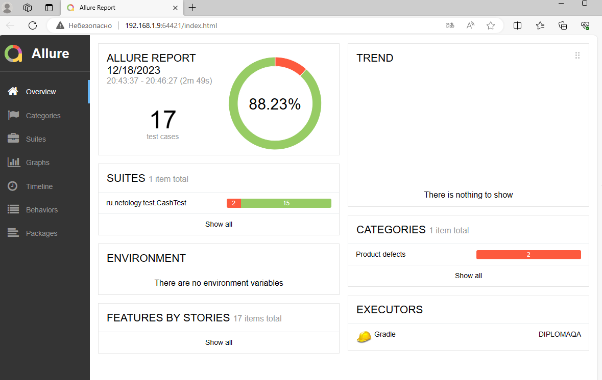

 ## Отчёт по итогам тестирования

#### Краткое описание

Проведена автоматизация тестирования банковского сервиса покупки тура.

Использованы следующие основные инструменты автоматизации:
* Java 8 - наиболее распространенная версия в настоящее время
* Junit 5 - позволяет создавать автоматизированные тесты на java
* Selenide - для автоматизации UI тестов на java c простым синтаксисом
* Allure - генератор отчётов тестирования

Вспомогательные инструменты в docker-контейнерах:
* MySQL - база данных с которой может работать приложение
* PostgreSQL - вторая база данных с которой может работать приложение
* node-js - окружение в котором работает симулятор банковского сервиса

#### Количество тест-кейсов

Создано 34 тест-кейсов:
* Пройдено успешно: 32
* Тестов не пройдено: 2

#### Найденные дефекты

1. Для поля Владелец нет никаких ограничений на ввод (в т.ч. на возможность ввода значений на кириллице) (Критичный баг)

#### Дефекты, обнаруженные при ручном тестировании:

1. Появляется сообщение о некорректности заполнения заполненного поля Владелец при пустом поле CVC 

2. Если закрыть всплывающее окно с текстом "Ошибка! Банк отказал в проведении операции" видно, что под ним расположено всплывающее окно с текстом "Операция одобрена Банком" (минорный баг)

3. При оформлении оплаты (кредита) по карте со статусом DECLINED появляется всплывающее окно с текстом "Операция одобрена Банком" 

#### Общие рекомендации

1. Устранить критичный баг - ограничить ввод данных в поле Владелец значениями на латинице
2. Создать документацию для данного приложения
3. Добавить функциональность блокирования кнопки "Продолжить" до тех пор, пока все поля не будут заполнены корректными значениями
4. Добавить изменение цвета кнопок "Купить" и "Купить в кредит" при переключении между двумя вкладками для удобства пользователя
5. Заменить предупреждения "Неверный формат" на более информативные